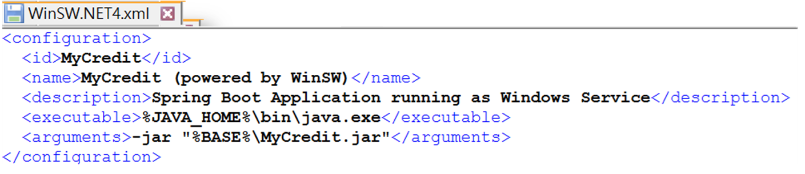
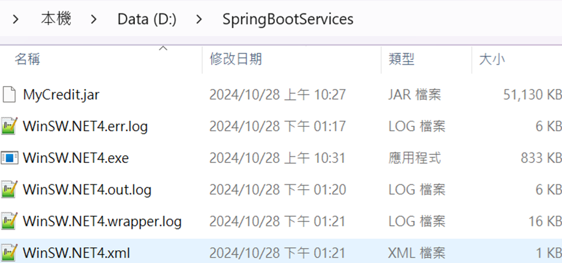
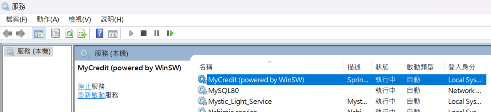
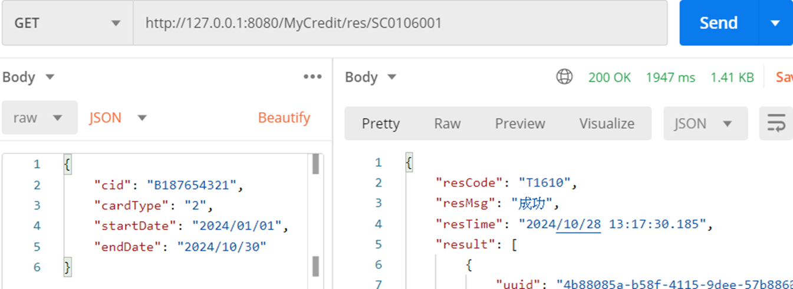

## Spring boot模組化單體架構程式範例jar服務運行
- Spring Boot 預設包含嵌入式的 Tomcat 伺服器，因此無需額外安裝外部的 Tomcat，即可啟動和運行 Spring Boot 應用程式
- 使用WinSW將 Spring Boot 應用程式安裝為 Windows 服務
	- mvn clean package 打包jar
	
	- 下載WinSW（https://github.com/winsw/winsw）
	
	- 撰寫WinSW.NET4.xml 
	 
	
	- 將jar、 WinSW、設定檔（.xml）放置指定位置D:\SpringBootServices 
	 
	
	- 安裝服務，至D:\SpringBootServices執行WinSW.NET4.exe install 
	
	- 開啟服務，執行安裝的應用服務 
	 

	- 測試可以正常發API 
	 
